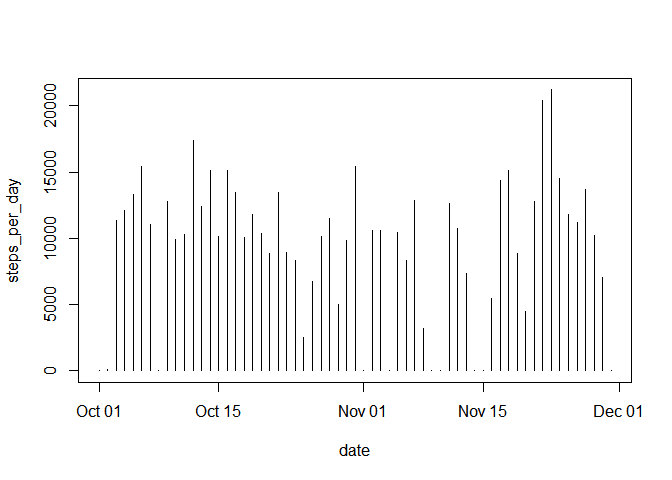
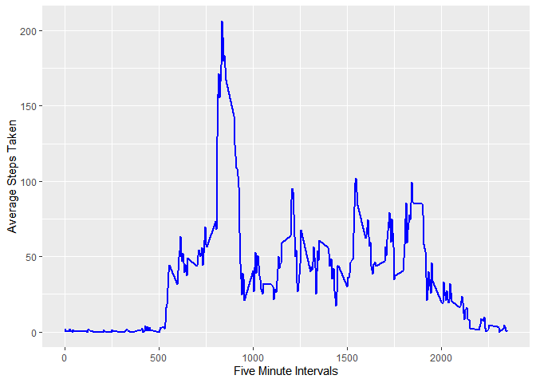
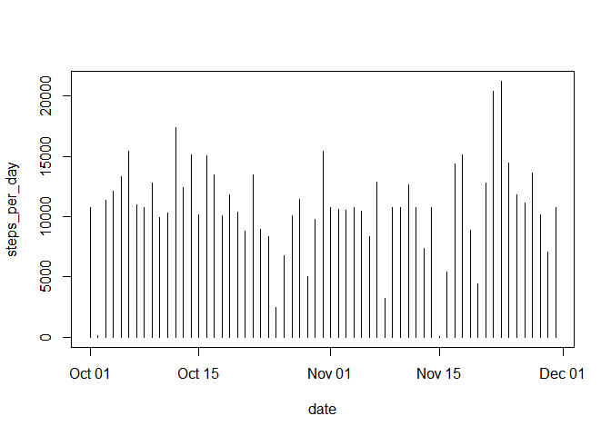
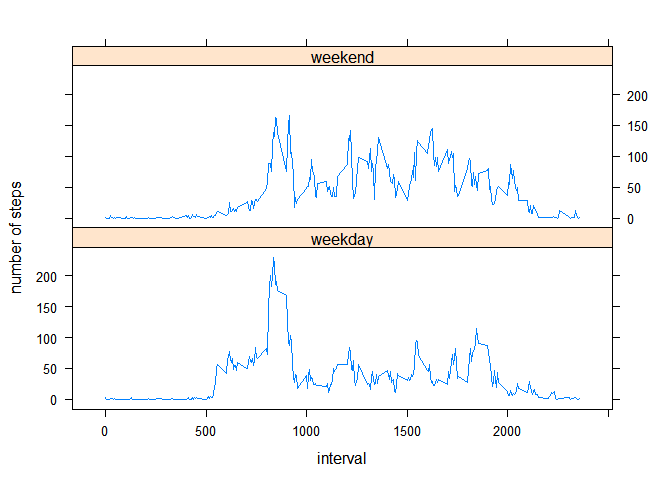

# Reproducible Research Week 2 Assignment

First step is to load in the data set. Make sure the directory is set to where the data is stored.


```r
        act <- read.csv("activity.csv")
```

Below is the total number of steps taken per day.


```r
        library(dplyr)
```

```
## Warning: package 'dplyr' was built under R version 3.5.3
```

```
## 
## Attaching package: 'dplyr'
```

```
## The following objects are masked from 'package:stats':
## 
##     filter, lag
```

```
## The following objects are masked from 'package:base':
## 
##     intersect, setdiff, setequal, union
```

```r
        library(knitr)
```

```
## Warning: package 'knitr' was built under R version 3.5.3
```

```r
        steps <-  act %>% group_by(date) %>% summarize("steps_per_day" = sum(steps, na.rm = TRUE))
        kable(steps, format = "markdown")
```


|date       | steps_per_day|
|:----------|-------------:|
|2012-10-01 |             0|
|2012-10-02 |           126|
|2012-10-03 |         11352|
|2012-10-04 |         12116|
|2012-10-05 |         13294|
|2012-10-06 |         15420|
|2012-10-07 |         11015|
|2012-10-08 |             0|
|2012-10-09 |         12811|
|2012-10-10 |          9900|
|2012-10-11 |         10304|
|2012-10-12 |         17382|
|2012-10-13 |         12426|
|2012-10-14 |         15098|
|2012-10-15 |         10139|
|2012-10-16 |         15084|
|2012-10-17 |         13452|
|2012-10-18 |         10056|
|2012-10-19 |         11829|
|2012-10-20 |         10395|
|2012-10-21 |          8821|
|2012-10-22 |         13460|
|2012-10-23 |          8918|
|2012-10-24 |          8355|
|2012-10-25 |          2492|
|2012-10-26 |          6778|
|2012-10-27 |         10119|
|2012-10-28 |         11458|
|2012-10-29 |          5018|
|2012-10-30 |          9819|
|2012-10-31 |         15414|
|2012-11-01 |             0|
|2012-11-02 |         10600|
|2012-11-03 |         10571|
|2012-11-04 |             0|
|2012-11-05 |         10439|
|2012-11-06 |          8334|
|2012-11-07 |         12883|
|2012-11-08 |          3219|
|2012-11-09 |             0|
|2012-11-10 |             0|
|2012-11-11 |         12608|
|2012-11-12 |         10765|
|2012-11-13 |          7336|
|2012-11-14 |             0|
|2012-11-15 |            41|
|2012-11-16 |          5441|
|2012-11-17 |         14339|
|2012-11-18 |         15110|
|2012-11-19 |          8841|
|2012-11-20 |          4472|
|2012-11-21 |         12787|
|2012-11-22 |         20427|
|2012-11-23 |         21194|
|2012-11-24 |         14478|
|2012-11-25 |         11834|
|2012-11-26 |         11162|
|2012-11-27 |         13646|
|2012-11-28 |         10183|
|2012-11-29 |          7047|
|2012-11-30 |             0|

Below is a histogram of the steps taken per day. Although this information would be better shown in a barplot.


```r
        steps$date <- as.Date(steps$date, format = "%Y-%m-%d")
        with(steps, plot(date, steps_per_day, type = "h"))
```

<!-- -->


```r
        mean <- round(sum(steps$steps_per_day) / nrow(steps),2)
```

The mean number of steps taken per day is 9354.23.


```r
        med <- median(steps$steps_per_day)
```

The median number of steps taken per day is 10395.


This time series shows the average number of steps taken in each five minute time interval:


```r
        library(ggplot2)
```

```
## Warning: package 'ggplot2' was built under R version 3.5.3
```

```r
        avg_intervals <- act %>% group_by(interval) %>% summarize(avg = mean(steps, na.rm = TRUE))
        g <- ggplot(avg_intervals, aes(x = interval, y = avg))
        g <- g + geom_line(color = "blue", size = 1)
        g <- g + xlab("Five Minute Intervals") + ylab("Average Steps Taken")
        g
```

<!-- -->


```r
        max_int <- avg_intervals$interval[which.max(avg_intervals$avg)]
```

The time interval with the maximum number of steps is 835.


```r
        missing <- sum(!complete.cases(act))
```

The total number of rows in the original data set with missing values is 2304.


We will impute the missing values based on the average of that respective five minute interval. Note that averages needed to be rounded to the nearest step in order for the coalesce function to work (also taking a fraction of a step does not make much sense practically).


```r
        act2 <- act %>% left_join(avg_intervals, by = "interval") %>% 
                        mutate(imp_steps = coalesce(steps,as.integer(round(avg,0)))) %>%
                        select(-steps, -avg)
```


```r
        steps2 <- act2 %>% group_by(date) %>% summarize("steps_per_day" = sum(imp_steps))
        imp_mean <- round(sum(steps2$steps_per_day) / nrow(steps2),2)
        imp_med <- median(steps2$steps_per_day)
        mean_diff <- imp_mean - mean
        med_diff <- imp_med - med
        total_diff <- sum(steps2$steps_per_day) - sum(steps$steps_per_day)
```

The mean number of steps taken per day is 1.076564\times 10^{4}.The mean with imputed values is 1411.41 steps larger than the mean with NAs excluded. The median number of steps taken per day is 10762. The median with imputed values is 367 larger than the median with NAs excluded. Using imputed values provided an additional 86096 steps over the two month period compared to the just excluding NAs.

Here is a histogram of step taken each day with NA values imputed by the interval average: 


```r
        steps2$date <- as.Date(steps2$date, format = "%Y-%m-%d")
        with(steps2, plot(date, steps_per_day, type = "h"))
```

<!-- -->

Now we will check for activity differences based on weekends and weekdays. Here are two time series showing the average number of steps per five minute interval separated by weekends and weekdays.


```r
        act2$date <- as.Date(act2$date, format = "%Y-%m-%d")
        act_day <- act2 %>% mutate(day = weekdays(date)) %>% 
                        mutate(week = ifelse(grepl("Saturday|Sunday", day), "weekend", "weekday"))
        act_day$week <- as.factor(act_day$week)
        act_day <- act_day %>% group_by(interval, week) %>% summarize(avg = mean(imp_steps))
        
        library(lattice)
        xyplot(avg ~ interval | week, data = act_day, layout = c(1, 2), type = "l", ylab = "number of steps")
```

<!-- -->
